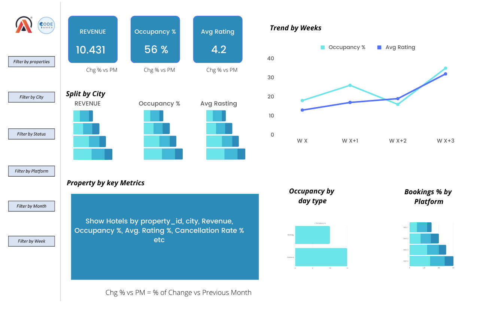

# Atliq Hospitality Analysis-PowerBI
As part of the codebasics resume challenge practice, I have built a dashboard in Power BI  to analyze three months sales data of different Atliq hotels across four different cities.

## Problem statement
Atliq Grands owns multiple five-star hotels across India. They have been in the hospitality industry for the past 20 years. Due to strategic moves from other competitors and ineffective decision-making in management, Atliq Grands are losing its market share and revenue in the luxury/business hotels category. As a strategic move, the managing director of Atliq Grands wanted to incorporate “Business and Data Intelligence” in order to regain their market share and revenue. However, they do not have an in-house data analytics team to provide them with these insights.

Their revenue management team had decided to hire a 3rd party service provider to provide them insights from their historical data.

## Task List
You are a data analyst who has been provided with sample data and a mock-up dashboard to work on the following task. You can download all relevant documents from the download section.

- Create the metrics according to the metric list.
- Create a dashboard according to the mock-up provided by stakeholders.
- Create relevant insights that are not provided in the metric list/mock-up dashboard.

## Provided Mock-up Dashboard

## Data Model

## Hospitality Analysis By Data Visualisation

## Some Important insights from the Dashboard
- Mumbai generates the highest revenue 669M followed by Bangalore, Hyderabad and Delhi.
- Overall occupancy stands at 58%.
- AtliQ Exotica performs better compared to all 7 type of properties with 320M of revenue, 3.62% rating,57.26% of occupancy,70.63% Realisation and 24.37% Cancellation rate.
- AtliQ Blu has the highest occupancy of 62% approx.
- Week 24, Week 27, and Week 29 are recorded the highest revenue among all, which is approximately 140 Million.
- Delhi tops both in occupancy and rating followed by Hyderabad, Mumbai, Bangalore.But Delhi generate the lowest revenue of 295M.
- Elite type rooms has the most booking.
- Almost 41% of hotels are reserved by other social platform.
